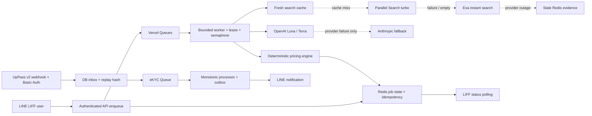

# Production Readiness: LLM, Search, Queues, eKYC และ Security

อัปเดตล่าสุด: 1 สิงหาคม 2026 (Asia/Bangkok)

เอกสารนี้อธิบายสิ่งที่พัฒนาใน repository ปัจจุบัน วิธีทำงานจริง ค่าใช้จ่ายที่วัดจาก API และรายการที่ต้องทำก่อนเปิด production ระบบถูกออกแบบให้ fail closed ในจุดที่เกี่ยวกับตัวตน สิทธิ์ และสถานะทางการเงิน แต่คำว่า “production ready” ในเอกสารนี้หมายถึงพร้อมเข้าสู่ staging/load test และ deploy gate—not การรับรองว่าไม่มีความเสี่ยงทุกกรณี

## 1. สถานะโดยสรุป

ส่วนที่ implement แล้ว:

- OpenAI เป็น LLM provider หลักทั้งหมด โดยใช้ `gpt-5.6-luna` สำหรับงาน vision/งานปริมาณสูง และ `gpt-5.6-terra` สำหรับ normalization, canonicalization และคัดหลักฐานราคา
- Anthropic เดิมยังอยู่เป็น emergency fallback โดยไม่ถูกเรียกเมื่อ OpenAI ทำงานสำเร็จ
- reasoning effort เปลี่ยนจาก `xhigh/max` ทุก call เป็น `none/low` ตามความยาก และใช้ `medium` เฉพาะ quality retry ที่จำเป็น
- Parallel Search integration `parallel-emerald-pendant-astly` เป็น search provider หลัก; Exa integration `astly-exa-search-api-teal-notebook` เป็น fallback; stale Redis cache เป็น fallback สุดท้าย
- Vercel Queues แยกงาน estimate ทั่วไป, estimate โน้ตบุ๊ก, วิเคราะห์สภาพ และ UpPass webhook พร้อม idempotency, distributed lease, retry, backoff, concurrency guard และ application DLQ
- UpPass eKYC ใช้ LIFF ID token ที่ตรวจ server-side, Basic Auth webhook แบบ fail closed, replay protection, durable inbox/outbox และ monotonic status transition
- ราคาประเมินที่ใช้สร้างคำขอสินเชื่อถูกผูกด้วย HMAC attestation จาก server; browser ไม่สามารถเปลี่ยนราคา/ความมั่นใจ/สินค้าแล้วส่งเข้าระบบโดยตรง
- API สำคัญถูกเพิ่ม LIFF ownership/role checks, bounded JSON/multipart, private Blob validation, rate limits, distributed financial locks, slip replay fingerprint และ sanitized errors
- OpenAI/Anthropic/search usage ถูกบันทึกเป็น token/cost telemetry พร้อมเพดานราย job, ราย owner ต่อวัน และรายระบบต่อเดือน

ก่อนเปิด traffic จริงยังต้องผ่าน deploy gates ในหัวข้อ 11 โดยเฉพาะการ rotate secrets, รัน migrations, ทดสอบ UpPass v2 payload จริง, ทดสอบ Queue/Blob บน Vercel และ load/chaos test

### ตัวบล็อกที่ยืนยันแล้วด้วยการ probe schema จริง (1 ส.ค. 2026)

`npm run preflight:production` ยิงเข้า Supabase REST ของ project ที่ตั้งไว้ใน `.env.local` แล้วพบว่า **migration ทั้ง 4 ไฟล์ยังไม่ถูก apply**:

| Migration | ผลกระทบถ้าไม่รัน |
|---|---|
| `2026_08_01_harden_ekyc.sql` | ไม่มี `ekyc_attempts` / `ekyc_webhook_events` → UpPass webhook ตอบ 503 ทุก event และ reconcile cron ล้มทุกนาที |
| `2026_08_01_harden_ekyc_delivery_ordering.sql` | ไม่มี generation fencing และ actor watermark → กัน out-of-order/duplicate event ไม่ได้ |
| `2026_08_01_harden_estimate_integrity.sql` | ไม่มี `items.estimate_attestation` / `loan_requests.estimate_reference_id` → ผูกราคาที่ server ลงนามกับคำขอสินเชื่อไม่ได้ |
| `2026_08_01_harden_price_observation_evidence.sql` | ไม่มี `price_observations.evidence_status` → observation-first cache ใช้ไม่ได้ ทุกคำขอจึงยิง search ใหม่ (cost สูงกว่าที่ประเมินไว้มาก) |

`2026_08_01_harden_transaction_integrity.sql` ใช้ `CREATE INDEX CONCURRENTLY` จึง probe ด้วย REST ไม่ได้ ต้องตรวจด้วย `\di` หรือ `pg_indexes` เอง และต้องรันแบบ autocommit (นอกทรานแซกชัน)

`2026_08_01_harden_mongodb_indexes.js` เป็นฝั่ง MongoDB ต้องรันแยกและไม่ได้อยู่ใน preflight probe

## 2. ภาพรวมสถาปัตยกรรม

Queue message มีเพียง `{ jobId, schemaVersion }`; request เต็มและรูปไม่ถูกใส่ลง message สาธารณะ ข้อมูลขนาดเล็กอยู่ใน Redis และ payload ใหญ่เกิน 512 KB ถูกเก็บใน private Vercel Blob

## 3. LLM inventory และ effort policy

| งาน | Primary | Effort เริ่มต้น | Quality escalation | Fallback |
|---|---|---:|---:|---|
| ตรวจว่ารูปตรงประเภทและเป็นสินค้าชิ้นเดียวกัน | Luna, low-detail image | `none` | ไม่ retry เพื่อเพิ่ม cost; รูปไม่ชัดให้ผู้ใช้ถ่ายใหม่ | Claude Haiku เมื่อ OpenAI error |
| ให้คะแนนสภาพจากรูปสูงสุด 4 รูป | Luna, high-detail image | `low` | manual/retry flow เมื่อประเมินไม่ได้ | Claude Haiku เมื่อ OpenAI error |
| Normalize ชื่อสินค้าทั่วไป | Terra | `none` | `low` เมื่อ output ไม่ผ่าน schema/quality gate | Claude Sonnet |
| คัดราคา used-market จากหลักฐาน search | Terra | `low` | `medium` หนึ่งครั้งเมื่อได้ comparable listings ไม่พอ | Claude Sonnet |
| Normalize ชื่อโน้ตบุ๊ก | Terra | `none` | `low` เมื่อจำเป็น | Claude Sonnet |
| อ่านรุ่น/CPU/RAM/Storage ที่ขาดจากรูป | Luna, สูงสุด 4 รูป | `none` | ผู้ใช้แก้ข้อมูล/ถ่ายใหม่ | Claude Haiku |
| Canonicalize CPU/RAM/Storage/GPU/ปี/segment | Terra | `low` | `medium` ผ่าน env/eval เมื่อจำเป็น | Claude Sonnet แล้ว heuristic |
| คัด used listings/family/new-price anchors | Terra | `low` | `medium` หนึ่งครั้งเมื่อหลักฐานไม่พอ | Claude Sonnet |
| กรอง SerpAPI (ปิดโดย default) | Terra | `none` generic / `low` notebook | `low`/`medium` | Claude Sonnet |
| อ่านสลิปเมื่อ SlipOK ไม่ได้ตั้งค่า | Luna | `low` | ไม่มี auto-escalation | Claude Haiku |

เหตุผลที่ไม่ใช้ `xhigh/max` ทุก call: normalization, schema extraction, exact URL selection และ OCR เป็นงาน constrained-output; reasoning tokens ที่สูงขึ้นเพิ่มทั้งเวลาและ output-token cost แต่ไม่ได้รับประกันว่าหลักฐานตลาดจะดีขึ้น ระบบจึงเพิ่มคุณภาพด้วย schema, deterministic validators, evidence allowlist และ manual-review gate ก่อน แล้วใช้ `medium` เพียงรอบเดียวเมื่อผลจริงไม่ผ่าน quality gate ค่า effort ทุก task override ได้ด้วย `OPENAI_EFFORT_<TASK>` แต่ควรเปลี่ยนหลัง offline eval เท่านั้น

`store` ของ OpenAI เป็น `false` โดย default, ใช้ explicit prompt cache 30 นาที, ไม่ส่ง raw LINE ID เป็น `safety_identifier`, จำกัดรูปสูงสุด 4 รูป และไม่ส่ง serial/user ID/image URL ไป search provider

### จำนวน call ต่อ workflow หลัง optimize

- สินค้าทั่วไป: Terra normalize 1 + Terra market extract 1 = ปกติ 2 LLM calls; เพิ่ม 1 call เมื่อ quality retry
- โน้ตบุ๊กสเปกครบ: Terra normalize 1 + Terra canonicalize 1 + Terra market extract 1 = ปกติ 3 LLM calls; เพิ่ม 1 call เมื่อ quality retry
- โน้ตบุ๊กสเปกขาด: เพิ่ม Luna vision 1 call จาก flow ข้างบน
- หากเปิด SerpAPI: เพิ่ม Terra filter อีก 1 call
- วิเคราะห์สภาพ: Luna precheck 1 + Luna scoring 1 = 2 calls
- SlipOK พร้อม: ไม่มี LLM call; SlipOK ไม่พร้อม: Luna 1 call และ Anthropic เฉพาะเมื่อ OpenAI error

ตัวเลข 6–7 LLM calls แบบเดิมจึงไม่ใช่ default production อีกต่อไป เพราะการค้นหา/จัดกลุ่ม evidence ถูกรวมเป็น search request และ structured extraction ที่มี quality gate โดยยังคง pricing ladder, benchmark table, heuristic และ historical observations เป็น deterministic code

## 4. Search routing และ fallback

ลำดับคือ fresh Redis cache → Parallel Search → Exa → stale Redis cache:

1. Parallel ใช้ `turbo` โดย default, สูงสุด 10 results, excerpt ต่อผลถูกจำกัด และ timeout 12 วินาที
2. Exa ใช้ instant search พร้อม highlights และ timeout 30 วินาที
3. URL, tracking parameters, title และ excerpt ถูก normalize/bound ก่อนส่งให้ Terra
4. Terra เลือกได้เฉพาะ URL ที่ปรากฏใน search evidence; URL หรือราคาที่สร้างขึ้นเองถูกทิ้ง
5. fresh cache default 12 ชั่วโมง; stale evidence อยู่ได้ 7 วันและมี metadata `stale_fallback`
6. SerpAPI เป็น optional independent source และปิดด้วย `SERPAPI_ENABLED=false`; ไม่ใช่ fallback หลักของ Parallel

Parallel ระบุราคา Search API `turbo` $1/1,000 requests และ `basic/advanced` $5/1,000 requests ([Parallel pricing](https://docs.parallel.ai/getting-started/pricing)) ส่วน Exa Search base สูงสุด 10 results คือ $7/1,000 requests และ content/highlight อาจมีค่าเพิ่ม ([Exa pricing](https://exa.ai/pricing?tab=api)) Runtime ใช้ `costDollars.total` ของ Exa เป็น source of truth เมื่อ provider ส่งมา

## 5. ค่าใช้จ่าย LLM และ search

อัตรา official ที่ใช้ใน telemetry ณ 1 สิงหาคม 2026:

| Model/provider | Input / 1M | Cached input / 1M | Output / 1M | Cache write / 1M |
|---|---:|---:|---:|---:|
| GPT-5.6 Luna | $0.20 | $0.02 | $1.20 | $0.25 |
| GPT-5.6 Terra | $2.00 | $0.20 | $12.00 | $2.50 |
| Claude Haiku 4.5 fallback | $1.00 | - | $5.00 | - |
| Claude Sonnet 4.6 fallback | $3.00 | - | $15.00 | - |

ราคา OpenAI และ cache-write 1.25 เท่าของ input มาจากหน้า official ของ [Luna](https://developers.openai.com/api/docs/models/gpt-5.6-luna) และ [Terra](https://developers.openai.com/api/docs/models/gpt-5.6-terra) ค่าใช้จ่ายจริงขึ้นกับ input image tokens, output/reasoning tokens, cache hit และเรตราคาในวันออก invoice

### Live smoke และ recalculated end-to-end cost

ใช้ key ที่ตั้งอยู่ใน local environment กับข้อมูลทดสอบทั่วไป ไม่มีข้อมูลผู้ใช้/eKYC; แปลงที่ 32 บาท/USD:

| งาน | USD | THB | หมายเหตุ |
|---|---:|---:|---|
| Terra normalize แบบสั้น | 0.000502 | 0.0161 | live: 83 input, 28 output |
| Parallel turbo 10 results | 0.001000 | 0.0320 | live: 866 ms; cache miss |
| Parallel cache hit | 0 | 0 | ไม่เรียก provider |
| Exa fallback 5 results | 0.007000 | 0.2240 | live `costDollars.total`; 3.06 s |
| Generic estimate, first pass | 0.008216 | 0.2629 | token usage จาก live E2E เดิม + Parallel turbo rate |
| Notebook สเปกครบ, first pass | 0.011540 | 0.3693 | normalize + canonicalize + search + extract |
| Notebook ที่ต้อง quality retry | 0.025808 | 0.8259 | รวม Terra medium retry |
| Luna vision อ่านสเปกที่ขาด (เพิ่มจาก flow) | 0.000385 | 0.0123 | สูงสุด 4 รูป |
| Condition precheck + scoring | 0.001635 | 0.0523 | Luna low-detail + high-detail |
| AI slip OCR fallback | 0.000425 | 0.0136 | ไม่รวม SlipOK และไม่ auto-authorize โดย default |
| Claude Haiku fallback smoke | 0.000833 | 0.0267 | เกิดเฉพาะ fallback |
| Claude Sonnet fallback smoke | 0.002601 | 0.0832 | เกิดเฉพาะ fallback |

ตัวเลข end-to-end ที่ไม่ได้ยิงซ้ำใช้ token telemetry จาก live run เดิมแล้วคูณ rate official ปัจจุบัน ซึ่งเป็น linear ต่อ token; Parallel เปลี่ยนจาก basic $0.005 เป็น turbo $0.001 การยิงซ้ำทั้งหมดจะสร้างค่าใช้จ่ายโดยไม่เพิ่มข้อมูลเชิงตัดสินใจ

ตัวอย่าง capacity budget ต่อเดือน สมมติ 60% generic cache miss, 20% cache hit, 15% notebook first pass, 5% notebook quality retry และทุก flow วิเคราะห์สภาพหนึ่งครั้ง:

| จำนวน flow/เดือน | LLM + search โดยประมาณ |
|---:|---:|
| 1,000 | $9.59 / ฿306.76 |
| 10,000 | $95.86 / ฿3,067.58 |
| 100,000 | $958.62 / ฿30,675.84 |

นี่เป็น model ไม่ใช่ invoice guarantee และยังไม่รวม SlipOK, UpPass, LINE, Supabase, Redis, Blob, Vercel compute/egress และ fallback incident หาก Parallel ทุก request ล้มแล้วไป Exa ค่า search จะเพิ่มประมาณ $0.006 หรือ ฿0.192 ต่อ cache miss

### Cost controls ใน runtime

- reservation ก่อน provider call และ reconcile ด้วย usage จริงหลังจบ
- `AI_MAX_JOB_COST_USD`, `AI_MAX_OWNER_DAILY_COST_USD`, `AI_MONTHLY_BUDGET_USD`
- usage aggregate รายวันและ per-job events ใน Redis โดยไม่เก็บ raw prompt/รูป
- global result cache, image-hash cache, market cache และ extraction cache
- SDK retry เป็น 0; Queue เป็นผู้ควบคุม retry เพื่อไม่ให้เกิด hidden duplicate spend
- OpenAI key rotation ทำเฉพาะ rate-limit ต่อ key; billing/quota error ไม่เผา key ทุกตัว
- low-confidence estimate ไม่สร้างคำขอการเงินอัตโนมัติและต้อง manual review

## 6. Vercel Queues และ high concurrency

| Topic | งาน | Default concurrency |
|---|---|---:|
| `pawnline-estimate-generic-v1` | ประเมินสินค้าทั่วไป | 6 |
| `pawnline-estimate-notebook-v1` | ประเมินโน้ตบุ๊ก | 2 |
| `pawnline-condition-v1` | วิเคราะห์สภาพรูป | 8 |
| `ekyc-webhook-events` | ประมวลผล UpPass event/outbox | bounded consumer |

สถานะ job คือ `QUEUED → PROCESSING → COMPLETED`; provider 429/timeout/5xx เปลี่ยนเป็น `RETRYING` พร้อม `nextRetryAt`, ข้อความภาษาไทย และ `Retry-After` UI poll ต่อได้สูงสุด 15 นาทีโดยไม่ต้องค้าง HTTP request

กลไกป้องกัน burst/duplicate:

- Vercel Queue เป็น durable delivery แต่ถือว่า message อาจมาซ้ำ
- idempotency key ตอน enqueue, atomic claim, per-job process lock, heartbeat และ cancellation tombstone
- Redis sorted-set semaphore จำกัด concurrent provider calls แยก generic/notebook/condition
- exponential backoff + full jitter 5–300 วินาที และเคารพ provider `Retry-After`
- สูงสุด 8 application deliveries; หมด retry แล้วเก็บ sanitized metadata ใน application DLQ 7 วัน
- จำกัด owner: estimate 12/10 นาทีและ 60/วัน; condition 24/10 นาทีและ 120/วัน โดย override ผ่าน env ได้
- production ห้าม `waitUntil`; local dev เท่านั้นที่ใช้ synchronous background path

Vercel Queues ยังเป็น public beta, delivery เป็น at-least-once, retention สูงสุด 24 ชั่วโมง และไม่มี built-in DLQ จึงห้ามถอด idempotency/application DLQ และต้อง load test บน project จริงก่อนเปิด traffic ดูข้อจำกัดล่าสุดที่ [Vercel Queues](https://vercel.com/docs/queues)

### Provider capacity limiter (`lib/services/provider-capacity.ts`)

ชั้นนี้คือ “ระบบหยุดรอเมื่อ provider เต็มลิมิต” ที่แยกจาก job semaphore มันกันไม่ให้เรายิงเกิน RPM/TPM ของ provider ตั้งแต่ต้นทาง แทนที่จะรอให้ provider ตอบ 429 แล้วค่อยเสียเวลา/เสียเงิน

- นับ 3 มิติพร้อมกันใน Redis ผ่าน Lua script เดียว (atomic): requests/นาที, tokens/นาที และ concurrency
- นับสองระดับเสมอ: ระดับ provider (`openai:all`) และระดับ model (`openai:gpt-5.6-terra`) ปรับได้ด้วย `PROVIDER_CAPACITY_<PROVIDER>[_<MODEL>]_{RPM,TPM,CONCURRENCY}`
- ค่า default: OpenAI 240 rpm / 1,000,000 tpm / 16 concurrent, Anthropic 120 / 500,000 / 8, Parallel 120 rpm / 12, Exa 120 rpm / 8
- ลิมิตเป็น **ระดับ provider รวมทุก API key** ไม่ใช่ต่อ key การหมุน key จึงไม่เพิ่มเพดานนี้ ต้องปรับ env ตาม quota จริงของ account
- token reservation คิดแบบ upper bound ก่อนยิง (input ประมาณ + `max_output_tokens`) แล้ว **reconcile ด้วย usage จริง** หลัง provider ตอบ
- ถ้าเต็ม จะ throw `ProviderCapacityError` (`kind: RATE_LIMITED`, `retryable: true`) พร้อม `retryAfterMs` งานจึงกลับเข้า `RETRYING` ไม่ใช่ `FAILED` และผู้ใช้เห็นสถานะรอคิว
- `retryAfterMs` ของ RPM = เวลาถึงต้นนาทีถัดไป, ของ concurrency = เวลาที่ lease เก่าที่สุดจะหมดอายุ; ทั้งสองถูก clamp เป็น 5–300 วินาทีในตัว scheduler และ ≤300 วินาทีในข้อความที่ส่งให้ผู้ใช้
- `ProviderCapacityError` **ไม่** trigger การหมุน API key (มันเป็นลิมิตของเราเอง ไม่ใช่ของ provider) ต่างจาก 429 จริงของ provider ที่หมุน key ได้
- production ตั้ง fail-closed โดย default: ถ้า Redis ล่ม จะไม่ยิง provider แต่โยน `UPSTREAM_UNAVAILABLE` แบบ retryable แทน ปรับได้ด้วย `PROVIDER_CAPACITY_FAIL_CLOSED`

พฤติกรรมที่ยืนยันด้วย live test กับ Upstash จริง (9/9 ผ่าน ดูหัวข้อ 12):

| พฤติกรรม | ผลที่ยืนยันแล้ว |
|---|---|
| ครบ RPM | ปฏิเสธคำขอถัดไป พร้อม `retryAfterMs` ≤ ต้นนาทีถัดไป |
| settle หลังยิงเสร็จ | **ไม่คืน** โควตา RPM (เป็น counter ต่อนาที ตามที่ควรเป็น) |
| ครบ concurrency | ปฏิเสธ และคืน slot ทันทีที่ `settle()` |
| reservation เกิน TPM | ปฏิเสธคำขอที่สอง |
| reconcile token จริง | คืน headroom ที่จองเกินให้คำขอถัดไปใช้ได้ |
| timeout/ผลลัพธ์กำกวม (`settle()` ไม่ส่ง token) | **คง reservation ไว้** ไม่ปล่อยให้ยิงซ้ำทับ quota ที่อาจถูกใช้ไปแล้ว |
| เรียก `settle()` ซ้ำ | idempotent ไม่คืน slot/token ซ้ำซ้อน |

## 7. eKYC / UpPass security

### Initiation

- รับ LIFF ID token ใน Authorization header และตรวจ issuer, audience, subject, expiry กับ LINE server
- line ID จาก request body ไม่ถือเป็นหลักฐานตัวตน
- Seller และ Asset Funding ใช้ UpPass key/form/LIFF channel แยกกันและ fail closed หาก config ของ role ขาด
- API URL และ form URL ต้องเป็น HTTPS, host อยู่ใน allowlist, ห้าม redirect และมี timeout/response bound
- initiation limit 3 ครั้ง/15 นาทีใน Redis และ 5 ครั้ง/วันในฐานข้อมูล
- มี attempt ledger และ unique active-session guard ป้องกันสร้าง session ซ้ำ

### Webhook และ asynchronous processing

- UpPass documentation รองรับ No Auth หรือ Basic Auth; production บังคับ Basic Auth แยก role และเปรียบเทียบ credential แบบ constant time ([UpPass webhook setup](https://www.uppass.io/help/docs/user-guide/flows/connect/))
- legacy HMAC ใช้ได้เฉพาะตั้ง `legacy_hmac` อย่างชัดเจน; ไม่มี fallback ไป unauthenticated
- raw body สูงสุด 512 KB, schema allowlist, event hash/replay protection และ durable DB inbox
- webhook ตอบเร็วหลัง persist แล้วส่ง opaque event ID เข้า Queue
- processor ใช้ monotonic transition เพื่อไม่ให้ event เก่าย้อนสถานะที่ผ่านแล้ว
- LINE notification ใช้ outbox และ retry; reconcile cron ทุก 1 นาทีซ่อม event/outbox ที่ค้าง
- inbox ใหม่ไม่เก็บ raw national-ID answers, รูปบัตร, LINE ID หรือ form URL โดยไม่จำเป็น

### สิ่งที่ยังต้องยืนยันกับ UpPass ก่อน production

- ทดสอบ webhook version 2 payload/status/slug จริงของทั้งสอง form ใน staging
- ยืนยัน hostname ที่ใช้จริงแล้วกำหนด allowlist ให้แคบ
- ตั้ง Basic Auth ใน UpPass console ให้ตรง env และกด Test ให้ได้ 200
- กำหนด consent version, privacy notice, lawful basis, retention/deletion และสิทธิ์ของเจ้าของข้อมูลกับฝ่ายกฎหมาย
- ทำ cleanup/migration ของ legacy KYC records ที่เคยเก็บข้อมูลมากกว่ารูปแบบใหม่

## 8. Security และ financial integrity ที่เพิ่ม

- LIFF authentication แยก `PAWNER`, `INVESTOR`, `STORE`, `DROP_POINT`, `ADMIN`; admin ต้องอยู่ใน `ADMIN_LINE_IDS`
- API อ่านข้อมูลสัญญา/รายการตรวจ ownership จากฐานข้อมูล ไม่เชื่อ `viewer` หรือ `lineId` ใน query/body
- internal/cron routes ใช้ bearer secret และ fail closed หากไม่ได้ตั้งค่า
- JSON และ multipart ใช้ streaming byte limit; รูปตรวจ magic bytes และรองรับเฉพาะ JPEG/PNG/WebP/PDF ตาม route
- URL หลักฐานต้องเป็น private/public Vercel Blob store ของ project และ path prefix ที่กำหนด—not แค่โดเมนลงท้ายคล้ายกัน
- slip fingerprint SHA-256 ป้องกันใช้หลักฐานซ้ำข้าม payment workflows; shared Redis lock ปิด race condition
- financial mutations ใช้ distributed lock, compare-and-set/idempotency และ sanitized errors
- estimate attestation ผูก owner, item fingerprint, รูป, ราคา, condition, confidence, source และ expiry; เปลี่ยน field ใด field หนึ่งแล้ว token ใช้ไม่ได้
- loan amount ต้องไม่เกิน server-attested estimate และ confidence ต่ำกว่า `MIN_ESTIMATE_CONFIDENCE_FOR_SUBMISSION` ต้อง manual review
- SlipOK เป็น authoritative verifier เมื่อมี config; AI fallback อ่านยอดได้แต่ไม่สามารถพิสูจน์ความแท้/ผู้รับ/replay จึงไม่ auto-authorize โดย default (`ALLOW_AI_SLIP_AUTO_APPROVAL=false`)
- Next security headers เปิด HSTS ใน production, ปิด `x-powered-by` และ dependency audit ถูกนำเข้า validation gate

## 9. Error handling ที่ผู้ใช้เห็น

| กลุ่ม | HTTP/สถานะ | ข้อความ/การทำงาน |
|---|---|---|
| LIFF token ขาด/หมดอายุ | 401 | ให้เปิดผ่าน LINE และเข้าสู่ระบบใหม่ |
| ไม่มีสิทธิ์/ไม่ใช่เจ้าของ | 403 | แจ้งว่าไม่มีสิทธิ์ โดยไม่เปิดเผยว่ารายการของใคร |
| body/file ใหญ่หรือชนิดไม่ถูกต้อง | 413/415 | ระบุให้ลดขนาดหรืออัปโหลดไฟล์ที่รองรับ |
| owner rate limit | 429 + `Retry-After` | บอกให้รอและลองใหม่ ไม่ enqueue งานเพิ่ม |
| provider TPM/RPM/timeout | `RETRYING` | แสดงว่าระบบรอคิวและจะลองอัตโนมัติ พร้อมเวลาโดยประมาณ |
| budget guard | 429/503 | หยุดก่อน provider call และไม่เกิดค่าใช้จ่ายใหม่ |
| search primary ล้ม | internal fallback | Parallel → Exa → stale cache โดยติด metadata/warning |
| LLM primary ล้ม | internal fallback | OpenAI → Anthropic; retryable error กลับเข้า Queue |
| job หมด retry | `FAILED` | ข้อความทั่วไป + correlation/job ID; เก็บ technical metadata ใน DLQ |
| estimate confidence ต่ำ | manual review | ไม่สร้าง loan request จากราคาที่ไม่มั่นใจ |
| AI อ่านสลิปตรงยอดแต่ไม่มี SlipOK | manual review | ไม่เปลี่ยนสถานะการเงินอัตโนมัติ |
| eKYC provider ช้า/ล้ม | retry/reconcile | session/event คงอยู่และซ่อมต่อด้วย Queue/cron |

API response ไม่ส่ง stack trace, SQL/provider raw message, secrets หรือ PII กลับผู้ใช้ Log ฝั่ง server ควรใช้ job/event/request ID และ error kind เท่านั้น

## 10. WAF, monitoring และ SLO แนะนำ

repository ไม่ได้เชื่อมกับ Vercel project ใน local environment จึงยังไม่ได้ apply WAF rules จริง แนวทาง deploy คือเปิด log-only 24–48 ชั่วโมงเพื่อหาค่า baseline แล้วค่อย block/rate-limit ที่ edge:

- `/api/upload*`, `/api/estimate/jobs`, `/api/analyze-condition/jobs`
- `/api/ekyc/initiate*`, `/api/ekyc/status*`
- LINE/UpPass webhook routes โดยใช้ method/path/body-size และ provider IP เมื่อ provider รับรองช่วง IP
- PIN/register/payment/action endpoints แยก rate ตาม IP + authenticated subject

ห้ามใช้ IP อย่างเดียวเป็น identity และห้ามตั้ง rule ที่ทำให้ legitimate LINE/UpPass webhook ถูก block โดยไม่ได้เฝ้า log แนวทาง Vercel อยู่ที่ [WAF rate limiting](https://vercel.com/docs/vercel-firewall/vercel-waf/rate-limiting)

ควร alert เมื่อ:

- queue oldest age > 2 นาที, retry rate > 5%, DLQ > 0
- OpenAI/Parallel/Exa 429 หรือ timeout > 2% ใน 5 นาที
- Anthropic fallback > 1% (แปลว่า primary มี incident)
- cache hit rate ต่ำกว่าค่า baseline, cost/job p95 สูงกว่าระดับที่กำหนด
- eKYC inbox/outbox ค้าง > 2 นาที หรือ reconcile แก้รายการจำนวนมากผิดปกติ
- payment replay/ownership failure พุ่งขึ้น, LIFF verification fail สูงผิดปกติ

SLO เริ่มต้นสำหรับ staging/load test: enqueue p95 < 1 วินาที, generic completion p95 < 90 วินาที, notebook p95 < 180 วินาที, condition p95 < 90 วินาที, eKYC webhook acknowledge p95 < 2 วินาที

## 11. Deploy checklist และ rollback

ทำตามลำดับนี้:

1. Rotate ทุก credential ที่เคยปรากฏใน terminal/chat/session นี้ก่อน production รวม OpenAI, Anthropic, Parallel, Exa, Supabase, MongoDB, Redis, LINE, UpPass, Blob, SlipOK และ internal secrets
2. ตรวจ `.env.example` แล้วตั้ง secret ใหม่ใน Vercel; ห้ามคัดค่าตัวอย่างและห้ามเปิด `ALLOW_AI_SLIP_AUTO_APPROVAL` โดยไม่มี fraud/manual-review design
3. รัน SQL migrations หลัง backup และ preflight duplicate audit — **ยืนยันแล้วว่ายังไม่ถูก apply ทั้งหมด** ต้องรันตามลำดับนี้:
   - `database/migrations/2026_08_01_harden_ekyc.sql`
   - `database/migrations/2026_08_01_harden_ekyc_delivery_ordering.sql` (ต่อยอดจากไฟล์แรก ห้ามสลับลำดับ)
   - `database/migrations/2026_08_01_harden_estimate_integrity.sql`
   - `database/migrations/2026_08_01_harden_price_observation_evidence.sql`
   - `database/migrations/2026_08_01_harden_transaction_integrity.sql` (**รันแบบ autocommit เท่านั้น** เพราะใช้ `CREATE INDEX CONCURRENTLY`)
   - `database/migrations/2026_08_01_harden_mongodb_indexes.js` (ฝั่ง MongoDB รันแยก)

   จากนั้นรัน `npm run preflight:production` ซ้ำ ต้องขึ้น `Supabase schema probe passed` ก่อนจึงจะ deploy ได้
4. เชื่อม private Vercel Blob และ Redis; ทดสอบ read/write/signed URL/TTL จาก Preview deployment
5. เปิด Vercel Queues topics/triggers ตาม `vercel.json`; ทดสอบ duplicate delivery, provider 429, function crash, lease expiry, cancellation, DLQ และ replay
6. ตั้ง UpPass v2 Basic Auth ของ Seller/Asset Funding และทดสอบ webhook/status/reconcile end-to-end
7. ทดสอบ LIFF ทุก role บน channel จริง รวม token expiry, wrong audience, owner mismatch และ access denied
8. รัน `npm run lint`, `npm run build`, `npm audit`, `git diff --check` และ smoke test estimate/condition/slip/eKYC
9. ทำ load test โดยใช้ synthetic data—not รูปบัตรหรือข้อมูลจริง—แล้วปรับ concurrency ให้ต่ำกว่า provider TPM/RPM และ DB connection ceiling
10. เปิด WAF log-only, ตรวจ false positive แล้ว promote เป็น blocking rules ทีละกลุ่ม
11. deploy แบบ canary/limited traffic และเฝ้า queue age, fallback, cost/job, error rate ก่อนเพิ่ม traffic

Rollback:

- ลด `JOB_CONCURRENCY_*` เป็น 1 เพื่อหยุด burst โดยไม่ทิ้งงาน
- ปิด enqueue endpoint ด้วย feature flag/WAF ชั่วคราว แต่ปล่อย consumer drain งานที่รับแล้ว
- เปลี่ยน Parallel `turbo → basic` เฉพาะเมื่อ quality eval แสดงว่าจำเป็น; search outage จะ fallback Exa/stale cache
- ปิด manual high-risk flow เช่น AI slip auto approval และ low-confidence loan submission แบบ fail closed
- schema migration ต้อง rollback ด้วย migration ที่ตรวจข้อมูลก่อน—not `DROP`/reset แบบทำลายข้อมูล

## 12. Validation และข้อจำกัดที่ต้องรับรู้

Validation ที่ทำใน development changeset นี้ประกอบด้วย targeted TypeScript/ESLint, OpenAI live cost smoke, Parallel turbo live search, Exa fallback live search, attestation tamper smoke, Anthropic fallback smoke และ dependency audit

### รอบตรวจสอบสุดท้าย (1 ส.ค. 2026)

รอบนี้เน้นพิสูจน์ 3 ส่วนที่เพิ่งเขียนใหม่ ไม่ใช่แค่ให้ compile ผ่าน

| Gate | คำสั่ง | ผล |
|---|---|---|
| TypeScript | `npx tsc --noEmit` | ผ่านทั้ง repository (แก้ 2 error ที่ค้างอยู่: PostgREST dynamic-select ใน `lib/ekyc/webhook-processor.ts` และ implicit `any` ใน `lib/services/market-search.ts`) |
| ESLint | `npx eslint . --quiet` | ไม่มี error |
| Build | `npm run build` | สำเร็จ ทุก route ถูก generate |
| Provider limiter | live test กับ Upstash จริง | 9/9 assertions ผ่าน (ตารางในหัวข้อ 6) |
| Price-evidence validator | unit test 2 ชุด | 35/35 assertions ผ่าน (Thai/USD parsing, tolerance, identity, outlier partition, digit-boundary regression) |
| Supabase schema | `npm run preflight:production` | **ไม่ผ่าน** — พบ migration ค้าง 4 ไฟล์ (หัวข้อ 1) |

### สิ่งที่แก้เพิ่มในรอบตรวจสอบนี้

1. `lib/services/price-evidence.ts` — เพิ่ม digit boundary (`(?<![\d.,])` … `(?!\d)`) รอบตัวจับตัวเลข เดิมตัวเลข 9 หลักขึ้นไปอย่าง `999999999 บาท` ถูก regex ตัดเหลือ 8 หลักแล้วกลายเป็น “หลักฐานราคา” 99,999,999 บาท ซึ่งเป็นการสร้างหลักฐานปลอมจากเลข order id / IMEI ที่บังเอิญอยู่ใกล้คำว่าบาท ตอนนี้เลขที่ยาวเกินถูกปฏิเสธทั้งก้อน
2. `lib/services/job-queue.ts` — clamp `retryAfterSeconds` ที่ส่งกลับผู้ใช้เป็น ≤300 วินาที ให้ตรงกับ retry scheduler เดิมค่านี้มาจาก lease ของ limiter ได้ตรง ๆ จึงมีโอกาสบอกผู้ใช้ให้รอนานถึง 15 นาที
3. `lib/ekyc/webhook-processor.ts`, `lib/services/market-search.ts` — แก้ type error ที่ทำให้ `tsc` ไม่ผ่าน
4. `scripts/production-preflight.ts` — เพิ่ม Supabase schema probe เดิม preflight ตรวจแต่ env จึงผ่านได้ทั้งที่ migration ยังไม่ถูกรัน แล้วไปพังตอน webhook ตัวแรกเข้า ปิดด้วย `--skip-schema` หรือ `PREFLIGHT_SKIP_SCHEMA=true` ได้เมื่อรันในที่ที่ไม่มี network

### รายละเอียดที่ตรวจแล้วไม่พบปัญหา

- **e-KYC recovery**: `ingest → claim → publish` ทำ CAS บน `(processing_status, processing_generation, updated_at)` ก่อน publish เสมอ ดังนั้น consumer ที่วิ่งเร็วกว่าจะไม่ถูก publisher เขียนทับย้อนสถานะ; การ revert เมื่อ publish ล้มถูก guard ด้วย `queued_at` จึงไม่ดึง `PROCESSING/PROCESSED` กลับ; ไม่มี trigger `updated_at` ในสคีมา ทุก path เขียน `updated_at` เอง CAS จึงเชื่อถือได้
- **generation fencing**: reconcile cron bump generation ทำให้ message เก่าที่ค้างใน Queue กลายเป็น no-op; `updateEventForGeneration` guard ด้วย generation ทุกครั้ง ผลลัพธ์จาก delivery เก่าจึงไม่เขียนทับ
- **LINE notification**: ใช้ `X-Line-Retry-Key = event.id` จึงกัน push ซ้ำในช่วงที่ LINE รับแล้วแต่ DB ยังไม่บันทึก `SENT`; 4xx ที่ไม่ใช่ 429 ถือเป็น permanent ไม่ retry วน
- **monotonic status**: `VERIFIED`/`REJECTED` เป็น terminal, event ที่มาช้ากว่า watermark (`kyc_last_provider_event_at` + tie-break ด้วย event hash) ถูกทิ้งและ mark `NOT_REQUIRED` ไม่ส่ง notification สถานะเก่า
- **evidence validation**: `hasDeterministicProductIdentity` บังคับว่า *ชื่อ listing* ต้องพิสูจน์ทั้ง brand และ family ด้วยตัวเอง เพราะ observation cache เก็บแค่ title แล้วต้อง revalidate ตอนอ่านซ้ำได้ ผลข้างเคียงคือ listing ที่ไม่พิมพ์ยี่ห้อ (เช่น "MacBook Air M2" ที่ไม่มีคำว่า Apple) จะถูกลดชั้นเป็น unverified ไม่ถูกเก็บเป็น observation → cache hit rate ต่ำลงและ cost สูงขึ้น ถ้า hit rate ในโปรดักชันต่ำกว่าเป้า ให้พิจารณาเพิ่ม brand alias table ก่อนไปลดความเข้มของ gate

ข้อจำกัดที่ยังไม่สามารถพิสูจน์จาก local environment:

- **e-KYC recovery ยังพิสูจน์ end-to-end ไม่ได้** เพราะตาราง `ekyc_attempts` / `ekyc_webhook_events` ยังไม่มีอยู่จริงในฐานข้อมูล การตรวจรอบนี้จึงเป็นการตรวจ logic + สคีมาที่ตั้งใจไว้ ไม่ใช่การรัน inbox/outbox/reconcile จริง ต้องทำซ้ำใน staging หลังรัน migration
- Vercel Queues/Blob deployed end-to-end เนื่องจาก local ไม่มี project link และ private Blob production token
- WAF rules ยังไม่ถูก apply
- UpPass payload/host/status จริงของบัญชี production
- provider SLA, DPA, zero-retention/no-training terms และ quota ที่ผูกกับ account จริง
- performance ภายใต้ traffic จริง, Supabase/MongoDB connection limits และ Vercel regional concurrency

ดังนั้น production approval ขั้นสุดท้ายต้องอาศัย Preview E2E, load/chaos test, security review, privacy/legal sign-off และ operational on-call/runbook—not เพียง `npm run build` ผ่าน

